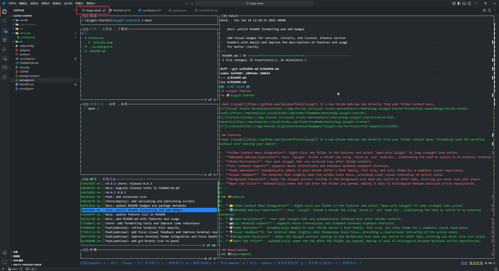

# 🚀 Lazygit Starter

Open [lazygit](https://github.com/jesseduffield/lazygit) in a new VSCode Webview tab directly from your folder context menu. Streamline your Git workflow without ever leaving your editor!

---

## ✨ Features

- **📂 Folder Context Menu Integration** - Right-click any folder in the Explorer and select "Open with lazygit" to jump straight into action.
- **🖥️ Integrated Terminal Experience** - Runs `lazygit` directly inside a VSCode tab, eliminating the need to switch to external terminal windows.
- **💾 State Persistence** - Your open lazygit tabs are automatically restored even after VSCode restarts.
- **⌨️ Full Terminal Support** - Supports mouse interactions and standard terminal keyboard shortcuts.
- **🎨 Theme Awareness** - Automatically adapts to your VSCode editor's font family, font size, and color theme for a seamless visual experience.
- **💡 Visual Feedback** - The terminal dims slightly when the window loses focus, providing a clear visual indication of the active state.
- **⚡ Background Execution** - Keeps the lazygit process running in the background even when you switch to other tabs, ensuring you never lose your place.
- **🏷️ Smart Tab Titles** - Automatically names the tab after the folder you opened, making it easy to distinguish between multiple active repositories.

## 🛠️ Requirements

You must have [`lazygit`](https://github.com/jesseduffield/lazygit) installed and available in your system's **PATH**.

## 🚀 Usage

1.  Open the **Explorer** view in VSCode.
2.  **Right-click** on any folder (or the project root).
3.  Select **"Open with lazygit"** from the context menu.
4.  Enjoy the full power of `lazygit` inside a dedicated VSCode tab! 🚀

## 📋 Copy & Paste

- **Paste**: Use `Ctrl+V` (Windows/Linux) or `Cmd+V` (macOS) to paste text. You can also use the browser's native **Right-click** context menu.
- **Copy**: Use the **Right-click** context menu to copy selected word.

## ⚙️ Extension Settings

This extension currently does not contribute any specific settings.

## 🐛 Known Issues

- **Executable Path:** Ensure `lazygit` is correctly installed. If the extension cannot find the `lazygit` executable, it may fall back to your default shell.

---

**Enjoy a faster Git workflow with Lazygit Starter!** 🌟
